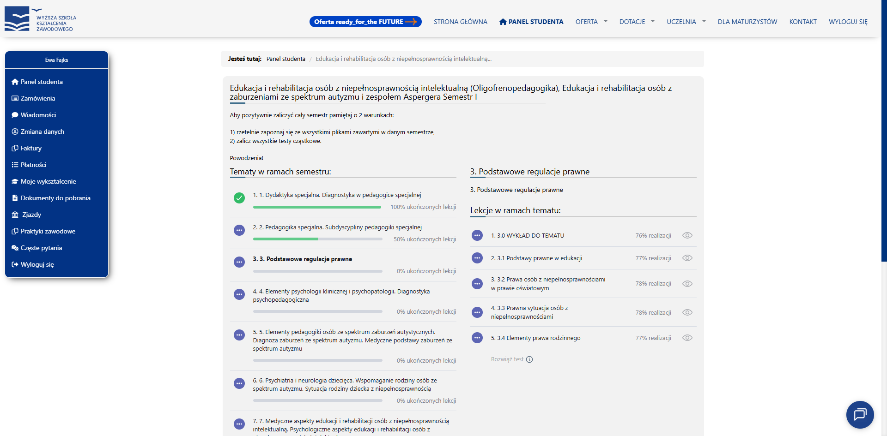

# UIGen

AI-powered React component generator. Describe a component in natural language, see it rendered live.



## What it does

- Chat with Claude to generate React components
- Live preview renders instantly in an iframe — no build step
- Code viewer shows generated source with syntax highlighting
- Projects saved to SQLite for authenticated users; localStorage for anonymous users

## Tech stack

- **Next.js 15** (App Router, Turbopack)
- **Vercel AI SDK** — streaming chat with tool use
- **Claude** (claude-haiku-4-5) — generates components via `str_replace_editor` and `file_manager` tools
- **Prisma + SQLite** — persistence
- **Tailwind CSS** + shadcn/ui
- **Babel standalone** — in-browser JSX transform inside the preview iframe

## Getting started

```bash
npm run setup       # Install deps + prisma generate + db migrate
```

Add your API key to `.env`:

```
ANTHROPIC_API_KEY=sk-ant-...
```

Without the key, the app runs with a mock provider that returns a static demo component.

```bash
npm run dev         # http://localhost:3000
```

## Commands

```bash
npm run dev         # Dev server
npm run build       # Production build
npm run lint        # ESLint
npm run test        # Vitest unit tests
npm run db:reset    # Reset SQLite database
```

## Usage

1. Sign up or continue as anonymous user
2. Describe the React component you want to create in the chat
3. View the generated component in the live preview
4. Switch to Code view to browse and inspect the generated files
5. Keep iterating — ask the AI to refine, extend, or restyle

## Architecture

All generated code lives in an **in-memory virtual filesystem** — nothing is written to disk.

```
User chat input
  → useChat() [Vercel AI SDK]
    → POST /api/chat/route.ts
      → Claude with two tools:
          str_replace_editor — create/edit file contents
          file_manager       — rename/delete files
        → VirtualFileSystem (in-memory Map)
          → persisted to SQLite via Prisma (authenticated users only)
```

**Key files:**

| File | Role |
|---|---|
| `src/lib/file-system.ts` | In-memory virtual filesystem |
| `src/lib/contexts/file-system-context.tsx` | Executes AI tool calls, triggers re-renders |
| `src/lib/contexts/chat-context.tsx` | Owns `useChat()` and message state |
| `src/components/preview/` | iframe preview with live JSX transform |
| `src/lib/provider.ts` | Switches between Anthropic and mock provider |
| `src/lib/prompts/generation.tsx` | System prompt for component generation |
| `src/lib/tools/` | Zod schemas for AI tools |
| `prisma/schema.prisma` | `User` and `Project` models |

## Auth

JWT stored in httpOnly cookies (7-day expiry). Anonymous users get localStorage-only persistence. Authenticated users get full project save/load via Server Actions in `src/actions/`.
